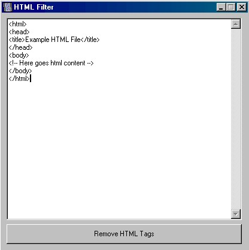



## The Super Fast HTML Filter

### Description

HTML Filter will filter all html tags from an HTML Content, and its fast (it processed 30 KB of HTML in 2.5 seconds in a Pentium at 500 Mhz), only paste the code and press the button, and "Vuala!" all done for you by Visual Basic!

Note: Please vote it if you can, please :)
 
### More Info
 

             |
---                |---
**Submitted On**   |2002-04-10 01:43:10
**By**             |[Design7 Software](https://github.com/Planet-Source-Code/PSCIndex/blob/master/ByAuthor/design7-software.md)
**Level**          |Beginner
**User Rating**    |4.3 (17 globes from 4 users)
**Compatibility**  |VB 3\.0, VB 4\.0 \(16\-bit\), VB 4\.0 \(32\-bit\), VB 5\.0, VB 6\.0, VB Script, ASP \(Active Server Pages\) , VBA MS Access, VBA MS Excel
**Category**       |[Internet/ HTML](https://github.com/Planet-Source-Code/PSCIndex/blob/master/ByCategory/internet-html__1-34.md)
**World**          |[Visual Basic](https://github.com/Planet-Source-Code/PSCIndex/blob/master/ByWorld/visual-basic.md)
**Archive File**   |[The\_Super\_706424102002\.zip](https://github.com/Planet-Source-Code/design7-software-the-super-fast-html-filter__1-33661/archive/master.zip)

